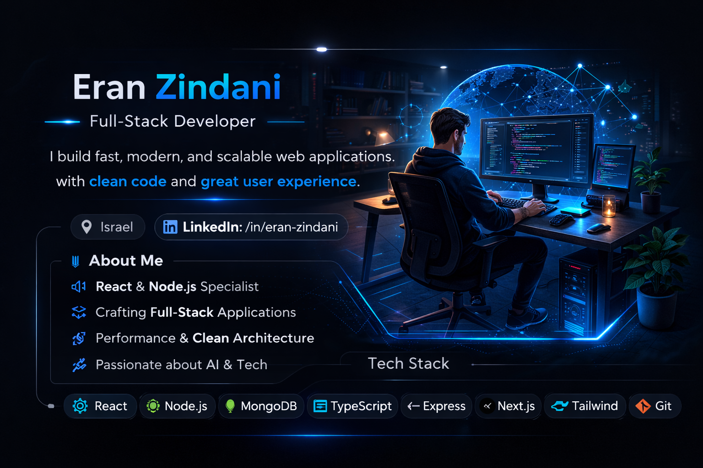

  

<h1 align="center">Eran Zindani</h1>

  Full-Stack Developer focused on building fast, reliable web apps with clean architecture and strong UX.

  <b>React</b> • <b>TypeScript</b> • <b>Node.js</b> • <b>Express</b> • <b>MongoDB</b> • <b>REST</b> • <b>Socket.IO</b>

  <a href="https://github.com/Proudjew12">GitHub</a>
  •
  <a href="https://www.linkedin.com/in/eran-zindani-50132633b/">LinkedIn</a>

---

### What I care about
- Shipping features that are **simple to maintain** (not clever code).
- **Performance + correctness** (debuggable, testable, predictable behavior).
- Product mindset: clear flows, good defaults, and smooth UI details.

### Principles
- Clean separation: UI ↔ services ↔ data
- Reusable components, predictable state
- Readable code > over-engineering
